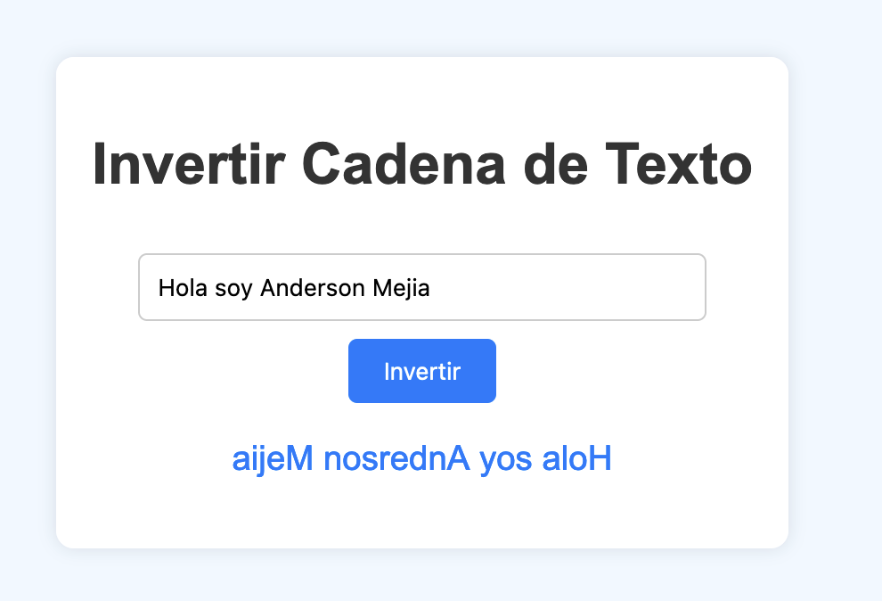

# Prompt 1: ChatGPT 4o

Eres un asistente de desarrollo de software y tengo el siguiente requerimiento.

Necesito crear una pagina web con lógica en javascript que invierta el orden de una cadena de texto.

Ejemplo: si introduzco AI4Devs devuelve sveD4IA.

En la implementación quiero que tenga dos archivos un index.html con el formulario que contenga input para ingresar el string, boton para invertir ese string y alguna etiqueta para mostrar ese resultado invertido.

Y el archivo script.js donde se programe la funcion para hacer el reverse al string capturando el valor del input desde el html.

Ademas agregar unos estilos agradables a la pagina para que sea de facil uso para el usuario.

Ejemplo

